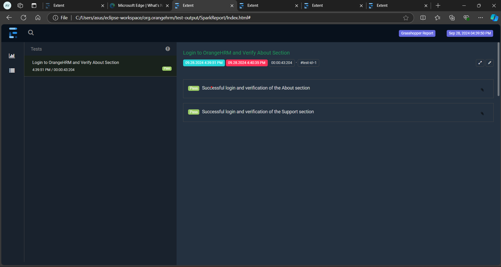

# OrangeHRM UI Automation Testing using Selenium and Cucumber

## Project Overview
This project automates the UI testing of the **OrangeHRM** website using **Selenium WebDriver** and **Cucumber**. It focuses on verifying core functionalities such as login and dashboard interactions.

## Tools and Technologies
- **Selenium WebDriver**: Automates browser interactions.
- **Cucumber**: Provides a framework for BDD (Behavior-Driven Development).
- **Java**: Core programming language used.
- **Maven**: Project management and dependency management.
- **JUnit**: Used for running the test suite.
- **ExtentReports**: Generates detailed test execution reports.
- **Apache POI**: Reads data from Excel files for data-driven testing.
- **Git**: Version control system.

## Project Structure
The project follows a typical Maven structure:

- src/test/java : 1. runners 2. stepdefinitions 3. utils
- src/test/resource : 1. features 2. test-data 3. extent.properties & extent-config.xml
- target : for cucumber report
- test-output : for spark & pdf report
- pom.xml
- cucumber gherkin plugin

## Extent Report

Here is a screenshot of the Extent Report generated by the automation:

